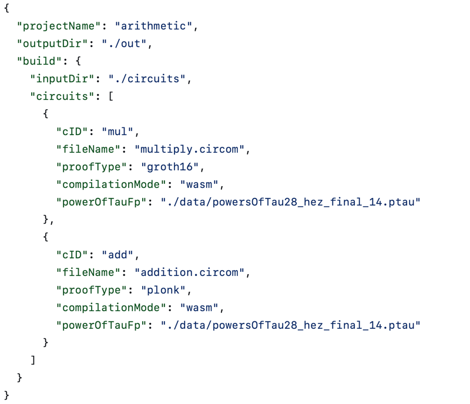

# CIRCOMJS
CircomJS is a javascript framework for automating and easing workflow around developing in the [Circom](https://docs.circom.io) DSL.

**We would suggest getting started with this [gitbook](https://zefi.gitbook.io/circomjs), and you should also checkout our [blog post](todo) on why we made CircomJS.**

The framework operates on a simple [circuit.config.js](https://zefi.gitbook.io/circomjs/circuit-config-file/circuit-config-file) file, which is a configuration file for circomJS.



You can also take a look at [CircomJS starter](https://github.com/getZeFi/circomjs-starter) repository for reference.

CircomJS gives you the following capabilities in Javascript!

### Compile your circuits

```javascript
const {CircomJS} = require("circomjs")

const main = async() => {
    const circomjs = new CircomJS()
    const circuit =  circomjs.getCircuit("mul")

    // it will build the circuit with cID mul
    await circuit.compile()
}

main()
```

### Generate Proofs

```javascript
const {CircomJS} = require("circomjs")

const main = async() => {
    const circomjs = new CircomJS()
    const circuit =  circomjs.getCircuit("mul")

    // important to await compilation, before running circuit.genProof()
    await circuit.compile()

    const input = {
        x: 3,
        y: 5
    }

    const proof = await circuit.genProof(input);
    console.log("proof verification result ----->",await circuit.verifyProof(proof))
}

main()
```

### Verify proofs

```javascript
const {CircomJS} = require("circomjs")

const main = async() => {
    const circomjs = new CircomJS()
    const circuit =  circomjs.getCircuit("mul")

    // important to await compilation, before running circuit.genProof()
    await circuit.compile()

    const input = {
        x: 3,
        y: 5
    }

    const proof = await circuit.genProof(input);
    console.log("proof verification result ----->",await circuit.verifyProof(proof))
}

main()
```

### and much more!
You can do a lot more than this:
- calculate witness
- calculate total constraints
- check constraints on a generated witness
- export solidity smart contract verifier { coming-soon }
- export solidity call-data { coming-soon }

### Upcoming features

We are working towards adding new features to the framework, some of which include:
- Support for C compilation of circuits { witness generation programs } 
- Automatic download of ideal power of tau file
- Parallel build of ZK Circuits
- Integration with Ethersjs to deploy smart contract verifiers
- Using sha-256 hashing to only build circuits when source code changes

We at zefi are open to ideas around the project and would love to interact with the community and see contributions comings its way, feel free to join our [telegram group](https://t.me/+7JPXv-RoXJk0MTVl) and say hi, also feel free to write to us at [contact@zefi.io](mailto:contact@zefi.io).