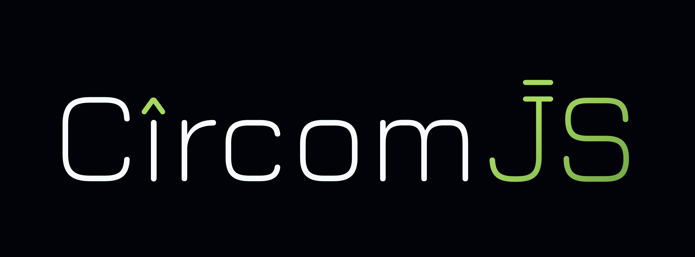

# CIRCOMJS



CircomJS is a javascript framework for automating and easing workflow around developing in the [Circom](https://docs.circom.io) DSL.

**We would suggest getting started with this [gitbook](https://zefi.gitbook.io/circomjs), and you should also checkout our [blog post](https://medium.com/zefihq/presenting-circomjs-54f476c075c4) on why we made CircomJS.**

The framework operates on a simple [circuit.config.js](https://zefi.gitbook.io/circomjs/circuit-config-file/circuit-config-file) file, which is a configuration file for circomJS.

below is an example of what a circuit.config.json file looks like.

```json
{
  "projectName": "arithmetic",
  "outputDir": "./out",
  "build": {
    "inputDir": "./circuits",
    "circuits": [
      {
        "cID": "mul",
        "fileName": "multiply.circom",
        "compilationMode": "wasm"
      },
      {
        "cID": "add",
        "fileName": "addition.circom",
        "proofType": "plonk",
        "compilationMode": "wasm"
      }
    ]
  }
}
```
(example circuit.config.json)

You can also take a look at [CircomJS starter](https://github.com/getZeFi/circomjs-starter) repository for reference.

CircomJS gives you the following capabilities in Javascript!

### Compile your circuits

```javascript
const {CircomJS} = require("@zefi/circomjs")

const main = async() => {
    const circomjs = new CircomJS()
    const circuit =  circomjs.getCircuit("mul")

    // it will build the circuit with cID mul
    await circuit.compile()
}

main()
```

### Generate Proofs

```javascript
const {CircomJS} = require("@zefi/circomjs")

const main = async() => {
    const circomjs = new CircomJS()
    const circuit =  circomjs.getCircuit("mul")

    // important to await compilation, before running circuit.genProof()
    await circuit.compile()

    const input = {
        x: 3,
        y: 5
    }

    const proof = await circuit.genProof(input);
    console.log("proof verification result ----->",await circuit.verifyProof(proof))
}

main()
```

### Verify proofs

```javascript
const {CircomJS} = require("@zefi/circomjs")

const main = async() => {
    const circomjs = new CircomJS()
    const circuit =  circomjs.getCircuit("mul")

    // important to await compilation, before running circuit.genProof()
    await circuit.compile()

    const input = {
        x: 3,
        y: 5
    }

    const proof = await circuit.genProof(input);
    console.log("proof verification result ----->",await circuit.verifyProof(proof))
}

main()
```

### and much more!
You can do a lot more than this:
- calculate witness
- calculate total constraints
- check constraints on a generated witness
- automatic download of ideal power of tau file

### Upcoming features

We are working towards adding new features to the framework, some of which include:
- support for C compilation of circuits { witness generation programs }
- parallel build of ZK Circuits
- integration with Ethersjs to deploy smart contract verifiers
- smart builds: only building circuits when either source code or a dependency of the circuit has changed.
- export solidity smart contract verifier
- export solidity call-data

We at zefi are open to ideas around the project and would love to interact with the community and see contributions comings its way, feel free to join our [telegram group](https://t.me/+7JPXv-RoXJk0MTVl) and say hi, also feel free to write to us at [contact@zefi.io](mailto:contact@zefi.io).